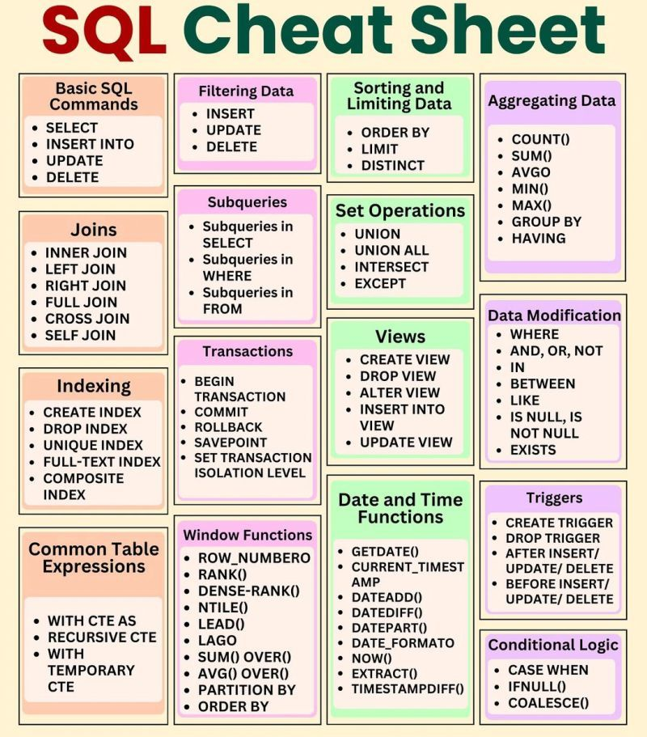

# SQL Cheat Sheet

**Author:** Kris Armstrong  
**License:** MIT  

## Overview
This cheat sheet provides an overview of SQL commands from basic to advanced levels. It includes:
- Basic SQL commands for beginners.
- Intermediate SQL commands such as joins and conditions.
- Advanced SQL concepts including subqueries, CTEs, and window functions.
- Best practices for learning and mastering SQL.

## Basic SQL Commands
- **SELECT** - Retrieve data from a table.
- **FROM** - Specify the table to query.
- **WHERE** - Filter records based on conditions (e.g., `=, <=, >=, <>`).
- **ORDER BY** - Sort query results.
- **Aggregate Functions** - `SUM()`, `AVG()`, `COUNT()`, etc.
- **GROUP BY** - Group rows that have the same values.
- **CREATE, INSERT, DELETE** - Basic data manipulation.

## Intermediate SQL Concepts
- **LEFT JOIN** - Returns all records from the left table, and matched records from the right table.
- **INNER JOIN** - Returns only matching records from both tables.
- **LIKE** - Pattern matching in `WHERE` conditions.
- **IN** - Check if a value exists within a set.
- **CASE WHEN** - Conditional statements within queries.
- **HAVING** - Filter grouped records (different from `WHERE`).
- **UNION ALL** - Combine results of multiple queries.

## Advanced SQL Topics
- **Subqueries** - When to use subqueries vs CTEs.
- **Common Table Expressions (CTEs)** - Use `WITH AS` for improved readability.
- **Stored Procedures** - Predefined SQL queries for automation.
- **Triggers** - Execute SQL code automatically in response to changes.
- **Window Functions** - Advanced analytics with `LEAD()`, `LAG()`, `PARTITION BY`, `RANK()`, and `DENSE_RANK()`.

## Best Practices for SQL Mastery
1. **Practice consistently** – SQL is all about logic and repetition.
2. **Start with basic queries** – Master `SELECT`, `FROM`, and `WHERE` first.
3. **Work on SQL projects** – Apply concepts through real-world datasets.
4. **Move to intermediate SQL** – Focus on joins, filtering, and aggregation.
5. **Learn advanced SQL** – Master window functions, CTEs, and stored procedures.
6. **Optimize performance** – Learn indexing, query optimization, and execution plans.
7. **Participate in SQL challenges** – Use platforms like LeetCode and Hackerrank.

## Learning Roadmap
1. **Day 1:** Learn basic SQL commands.
2. **Day 2:** Practice intermediate SQL with joins and conditions.
3. **Day 3-4:** Dive into advanced SQL concepts.
4. **Day 5+**: Work on projects, optimize queries, and explore real-world datasets.

## Additional Resources
- [README.md](README.md)
- [CONTRIBUTIONS.md](CONTRIBUTIONS.md)

---
*For more information, refer to SQL documentation and practice on online platforms.*  
